# Xây Dựng Pipeline LTSF với Linear Models, Airflow và MLflow

## 1. Xây Dựng Pipeline Dự Báo Giá Cổ Phiếu: Mô Hình và Quy Trình

Dự báo giá cổ phiếu luôn được xem là một trong những bài toán khó của khoa học dữ liệu. Thị trường tài chính biến động mạnh, chịu tác động của nhiều yếu tố gây nhiễu như tin tức, tin đồn, tâm lý nhà đầu tư và các sự kiện kinh tế bất ngờ. Những yếu tố này làm việc nhận diện quy luật trở nên phức tạp. Bên cạnh đó, giá cổ phiếu không thay đổi theo quy luật tuyến tính. Chúng chịu ảnh hưởng đồng thời của nhiều yếu tố tương tác phức tạp, nên khó phù hợp hoàn toàn với các mô hình truyền thống. Tính không dừng của chuỗi thời gian cũng khiến mô hình dễ mất ổn định. Tổng hợp tất cả yếu tố trên, dự báo giá cổ phiếu trở thành một nhiệm vụ đầy thách thức.

Trong bối cảnh đó, nhiều người thường cho rằng chỉ những mô hình cực kỳ phức tạp mới đủ khả năng xử lý dữ liệu tài chính. Tuy nhiên, hành trình khám phá các mô hình LTSF-Linear (Linear, NLinear, DLinear) lại mang đến một góc nhìn hoàn toàn khác. Đôi khi, chính sự đơn giản nhưng có mục đích rõ ràng mới tạo ra hiệu quả thực sự.


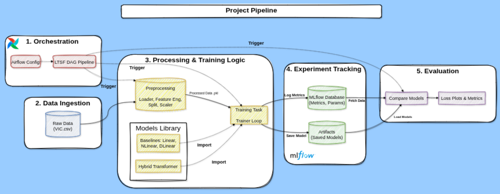


Để kiểm chứng các mô hình dự báo này, một pipeline hoàn chỉnh đã được xây dựng, bao gồm:

- Hệ thống tổ chức workflow bằng Apache Airflow.

- Quản lý thí nghiệm và mô hình bằng MLflow.

- Bộ mã nguồn triển khai đánh giá các mô hình Linear–NLinear–DLinear từ đầu.

Mục tiêu không chỉ là tìm mô hình tốt nhất, mà còn tạo ra một hệ thống dễ mở rộng, dễ thử nghiệm và bền vững.

## 2. Bài toán LTSF: Điều gì khiến dự báo dài hạn trở nên khó khăn?

Dự báo chuỗi thời gian dài hạn **(Long-Term Time Series Forecasting – LTSF)** là một bài toán đặc biệt khó vì ba đặc điểm quan trọng:

**Dữ liệu tài chính nhiễu mạnh**

Chuỗi giá liên tục lên xuống theo những mức dao động khó lường, khiến mô hình khó phân biệt đâu là tín hiệu thật và đâu chỉ là dao động ngẫu nhiên trong ngày.

**Tính phi tuyến và không dừng**

Không phải mọi mô hình đều có khả năng xử lý khi mặt bằng giá thay đổi đột ngột, khi thị trường chuyển pha, hoặc khi xuất hiện sự kiện kinh tế lớn.

**Sai số tích luỹ khi dự báo dài hạn**

Dự báo càng xa, rủi ro sai lệch càng lớn. Với chiến lược dự báo đệ quy, sai số bước trước trở thành đầu vào cho bước sau – khiến sai số phình to theo thời gian.

Những khó khăn này là lý do khiến các mô hình Linear–NLinear–DLinear được quan tâm trở lại. Chúng tập trung vào việc tách tín hiệu từ nhiễu, xử lý xu hướng và mùa vụ, thay vì cố gắng mô hình hóa mọi quan hệ phức tạp.

## 3. Bộ ba mô hình Linear – NLinear – DLinear

Các mô hình LTSF-Linear dựa trên một triết lý rõ ràng: dự báo trực tiếp toàn bộ T bước tương lai bằng các phép biến đổi tuyến tính, thay vì cố gắng mô hình hóa mọi quan hệ phức tạp. Nhờ vậy, mô hình vừa nhẹ, vừa nhanh, vừa ổn định.

---

### Linear – nền tảng tuyến tính mạnh mẽ

Linear học một **ma trận trọng số**  

$$
W \in \mathbb{R}^{T \times L}, \quad b \in \mathbb{R}^{T}
$$

để biến đổi L bước quá khứ thành T bước dự đoán tương lai:

$$
\hat{y} = W x + b
$$

- $x \in \mathbb{R}^L$ là cửa sổ giá quá khứ  
- $\hat{y} \in \mathbb{R}^T$ là dự báo cho T bước tới  

**Ví dụ:**  
- Quá khứ 5 ngày: [100, 102, 101, 103, 104]  
- Muốn dự đoán 3 ngày tiếp theo. Linear học ma trận W để chuyển 5 giá này thành 3 dự báo mới.  

**Ưu điểm:**  
- Nhẹ, nhanh, ổn định  
- Tránh tích lũy sai số  
- Hoạt động tốt với chuỗi ổn định, ít thay đổi đột ngột

---

### NLinear – xử lý “dịch mức” (level shift)

Trong thực tế, giá đôi khi **dịch toàn bộ lên hoặc xuống cùng lúc**. NLinear giải quyết bằng cách chuẩn hóa dữ liệu quanh giá cuối cửa sổ (re-centering):

$$
x' = x - x_L
$$

- $x_L$ là giá cuối cùng trong cửa sổ  
- Mô hình học trên độ lệch tương đối $x'$ thay vì giá tuyệt đối, sau đó cộng lại $x_L$ để trả về dự báo gốc  

**Ví dụ:**  
- Quá khứ 5 ngày: [100, 102, 101, 103, 104]  
- NLinear dùng $x' = x - 104 = [-4, -2, -3, -1, 0]$ để học biến động tương đối.  
- Dự báo xong cộng lại 104 để ra giá dự đoán thực tế.

**Ưu điểm:**  
- Giảm nhạy cảm với dịch mức cộng tính  
- Ổn định hơn trong môi trường tài chính biến động

---

### DLinear – tách xu hướng và mùa vụ

DLinear phân rã chuỗi thời gian thành:  

1. **Trend (xu hướng):** thay đổi chậm, thể hiện đường chính dài hạn của chuỗi  
2. **Seasonal/Residual (phần còn lại):** dao động nhanh, nhịp lặp ngắn hạn  

Sau đó, dùng **hai Linear head riêng biệt** để dự báo từng phần, rồi cộng lại:

$$
\hat{y} = \hat{y}_{\text{trend}} + \hat{y}_{\text{seasonal}}
$$

**Ví dụ minh họa:**  
- Quá khứ: [10, 12, 11, 13]  
- Trend (moving average, m=3): [10.67, 11.00, 12.00, 12.33]  
- Seasonal/residual = x - trend = [-0.67, 1.00, -1.00, 0.67]  
- DLinear dự báo riêng trend và residual → cộng lại để ra dự báo cuối cùng

**Ưu điểm:**  
- Phù hợp với chuỗi có xu hướng hoặc mùa vụ rõ ràng  
- Khi dữ liệu có trend, DLinear thường chính xác hơn Linear hay NLinear

### HybridDLinearTransformer – kết hợp DLinear và Transformer cho mùa vụ

HybridDLinearTransformer mở rộng DLinear bằng cách kết hợp **một nhánh Transformer** để dự báo phần seasonal/dao động ngắn hạn, trong khi nhánh trend vẫn dùng Linear. Cụ thể:  

1. **Decomposition:** tách chuỗi thành trend và seasonal (reuse DLinear)  
2. **Trend branch:** Linear dự báo xu hướng dài hạn  
3. **Seasonal branch:** Transformer học các dao động ngắn hạn, sau đó flatten và chuyển thành dự báo  
4. **Combine:** cộng dự báo trend và seasonal để ra kết quả cuối cùng  

**Công thức tổng quát:**  

$$
\hat{y} = \hat{y}_{\text{trend}} + \hat{y}_{\text{seasonal}}
$$

**Ưu điểm:**  
- Giữ độ nhẹ, ổn định của DLinear  
- Transformer tăng khả năng nắm bắt các seasonal phức tạp  
- Thích hợp chuỗi có cả trend dài hạn và dao động ngắn hạn


## 4. Cấu trúc project

Toàn bộ project được tổ chức theo cấu trúc module hóa, tách biệt chức năng, dễ mở rộng:

```bash
.
├── airflow
│   ├── config
│   │   └── airflow.cfg
│   ├── dags
│   │   ├── ltsf_pipeline_dag.py
│   │   └── __pycache__
│   ├── docker-compose.yaml
│   ├── Dockerfile
│   ├── logs
│   │   ├── dag_id=ltsf_baseline_pipeline
│   │   └── dag_processor
│   └── requirements.txt
├── data
│   ├── processed
│   │   ├── norm_splits.pkl
│   │   └── scaler.pkl
│   ├── raw
│   │   └── VIC.csv
│   └── train_results
│       ├── loss_history.pkl
│       └── loss_plots
├── mlflow
│   ├── docker-compose.yaml
│   ├── Dockerfile
│   ├── mlartifacts
│   │   └── 1
│   └── mlflow.db
├── notebooks
│   └── EDA.ipynb
├── pyproject.toml
├── README.md
└──  src
   ├── data
   │   ├── loader.py
   │   └── preprocess.py
   ├── evaluation
   │   └── evaluator.py
   ├── models
   │   ├── dlinear.py
   │   ├── hybrid_transformer.py
   │   ├── linear.py
   │   └── nlinear.py
   ├── training
   │   └── trainer.py
   └── utils
       └── plotting.py
```

## 5. Xây dựng ML Pipeline bằng Apache Airflow

**Apache Airflow** là một công cụ mã nguồn mở giúp **tự động hóa workflow** trong các dự án Data & ML.  
Airflow cho phép định nghĩa **DAG (Directed Acyclic Graph)**, tức luồng các task có thứ tự rõ ràng, để thực hiện tuần tự hoặc song song.  
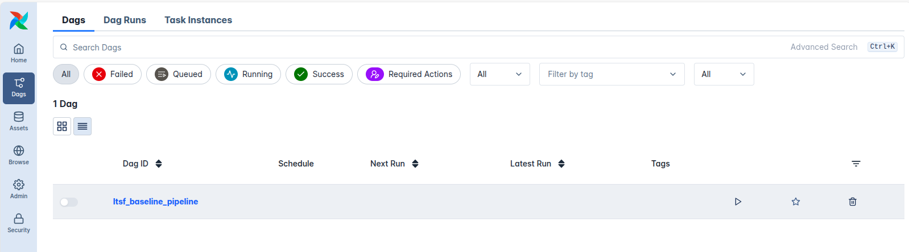
Với Airflow, các task như **load dữ liệu, huấn luyện mô hình** đều có thể tự động chạy, dễ theo dõi và tái lập.

---

### Các Task trong DAG `ltsf_baseline_pipeline`
<div align="center">
  
</div>

#### Task 1 — `load_and_prepare_data`
- **Mục tiêu:** Chuẩn bị dữ liệu cho các mô hình LTSF
- **Chi tiết công việc:**
  - Đọc dữ liệu raw từ CSV (`data/raw/VIC.csv`)  
  - Tạo các **univariate datasets** với nhiều look-back windows `[7, 30, 120, 480]`  
  - Chia thành **train/validation/test splits** theo thời gian  
  - Chuẩn hóa dữ liệu (normalize) để mô hình học ổn định  
  - Lưu các splits và scaler ra file pickle trong `data/processed/`  
- **XCom:** Push đường dẫn của normalized splits và scaler để task tiếp theo sử dụng

---

#### Task 2 — `train_models`
- **Mục tiêu:** Huấn luyện mô hình và lưu kết quả
- **Chi tiết công việc:**
  - Pull dữ liệu đã chuẩn hóa từ Task 1 qua **XCom**  
  - Huấn luyện các mô hình:  
    - **Linear** – dự báo trực tiếp  
    - **NLinear** – dự báo với dữ liệu đã re-centered  
    - **DLinear** – tách trend và seasonal  
    - **HybridDLinearTransformer** – mô hình kết hợp Linear và Transformer  
  - Huấn luyện trên các horizon khác nhau: 7d, 30d, 120d, 480d  
  - Lưu biểu đồ loss và scaler  
  - Lưu toàn bộ history và checkpoints cho các mô hình

---

DAG Flow

```
load_and_prepare_data --> train_models
```

- Các task được kết nối theo thứ tự tuần tự  
- **XCom** dùng để truyền paths, artifacts giữa các task

**Lưu ý về XCom:**  

**XCom (Cross-communication)** là cơ chế của Airflow cho phép **các task trao đổi dữ liệu với nhau**.  
Trong DAG này, XCom được dùng để truyền:
  - Đường dẫn tới các **normalized splits** và **scaler** từ `load_and_prepare_data` sang `train_models`  
  - Các artifacts hoặc kết quả trung gian khác nếu cần giữa các task.  

XCom thích hợp cho dữ liệu **nhỏ và metadata**, không nên dùng để truyền file lớn trực tiếp. Thay vào đó, lưu file ra ổ đĩa (hoặc storage) rồi push đường dẫn qua XCom.

---

### Cách chạy và theo dõi DAG

Để khởi chạy quy trình huấn luyện, ta thực hiện thủ công qua giao diện Airflow:

Trigger DAG: Chọn DAG ltsf_baseline_pipeline và nhấn nút Trigger.

<div align="center">
  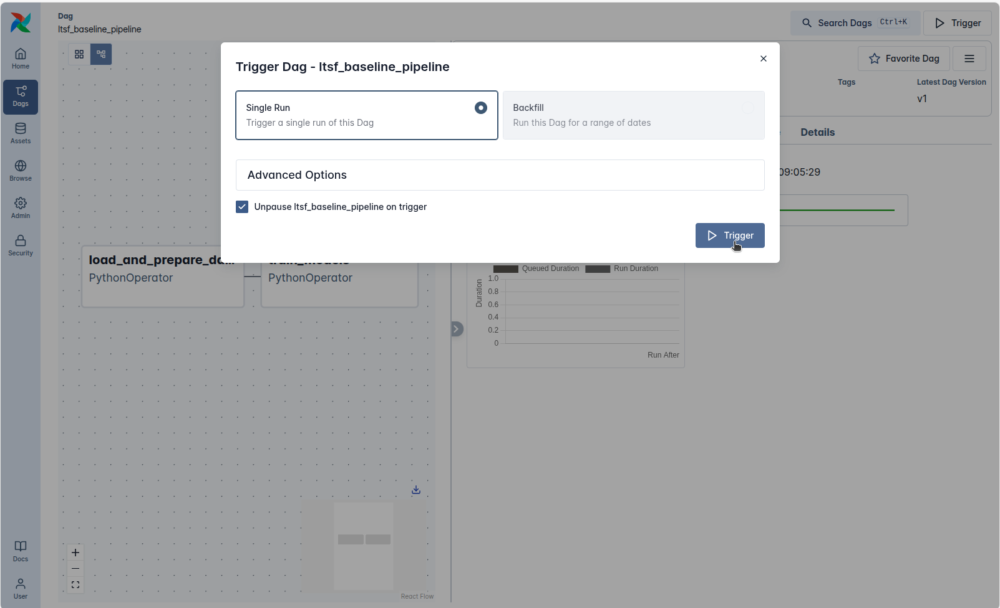
</div>

Lưu ý: Đảm bảo tích chọn "Unpause... on trigger". Mặc định DAG thường ở trạng thái Paused, nếu không bật tùy chọn này, Scheduler sẽ bỏ qua và pipeline sẽ bị treo ở trạng thái chờ (Queued) mãi mãi.

Theo dõi: Sau khi kích hoạt, luồng công việc sẽ chạy tuần tự từ chuẩn bị dữ liệu (load_and_prepare_data) đến huấn luyện (train_models). Bạn có thể giám sát trực tiếp các chỉ số (Loss, Epoch) qua bảng Logs thời gian thực.

Bên cạnh kích hoạt thủ công (Manual), hệ thống cũng hỗ trợ chạy tự động theo lịch trình (Schedule/Cron), qua dòng lệnh (CLI) hoặc REST API cho các kịch bản production.

<div align="center">
  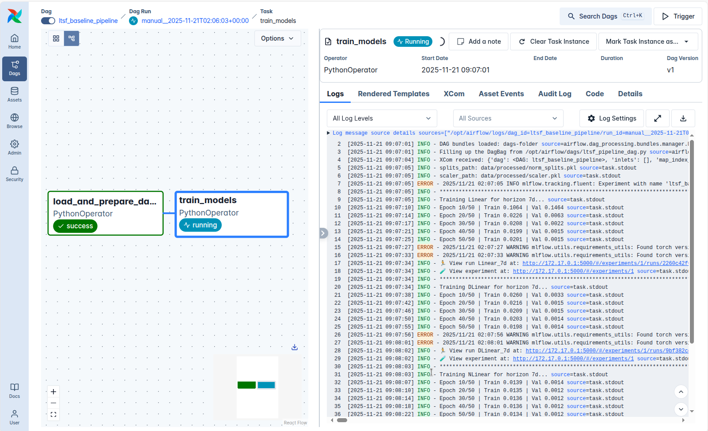
</div>


## 6. Theo dõi thí nghiệm bằng MLflow

MLflow là một nền tảng mã nguồn mở hỗ trợ quản lý toàn bộ vòng đời của mô hình học máy. Công cụ này cung cấp bốn chức năng cốt lõi: 
- Theo dõi thí nghiệm
- Đóng gói mô hình để tái sử dụng 
- Quản lý và lưu trữ mô hình
- Triển khai mô hình trên nhiều môi trường khác nhau 

Khi số lượng thí nghiệm tăng lên, MLflow cho phép lưu lại siêu tham số, kết quả đánh giá, artifact và phiên bản mô hình, giúp việc phân tích và so sánh các lần chạy trở nên dễ dàng và có khả năng tái lập.

---

Đây là giao diện Dashboard chính (Home) của MLflow Tracking Server. Khu vực quan trọng nhất là bảng Experiments (Thí nghiệm), nơi liệt kê toàn bộ các dự án đang được theo dõi.
Trong hình, ta thấy sự xuất hiện của experiment tên là `ltsf_baseline`. Điều này xác nhận kết nối thành công: Pipeline từ Airflow đã tự động khởi tạo experiment này để chuẩn bị lưu trữ các chỉ số huấn luyện (metrics) và model (artifacts) sắp tới.
<div align="center">
  
</div>

Giao diện Runs bên trong Experiment ltsf_baseline trên MLflow cho thấy toàn bộ các lần chạy (runs) được tạo ra từ pipeline của Airflow. Mỗi run tương ứng với một quy trình huấn luyện hoàn chỉnh, bao gồm toàn bộ thông số đầu vào, kết quả dự báo, metric đánh giá và mô hình sinh ra. Đây chính là nơi tập hợp toàn bộ kết quả cuối cùng sau khi DAG thực thi xong, giúp việc theo dõi và so sánh hiệu suất giữa các lần chạy trở nên trực quan và dễ kiểm soát.  

<div align="center">
  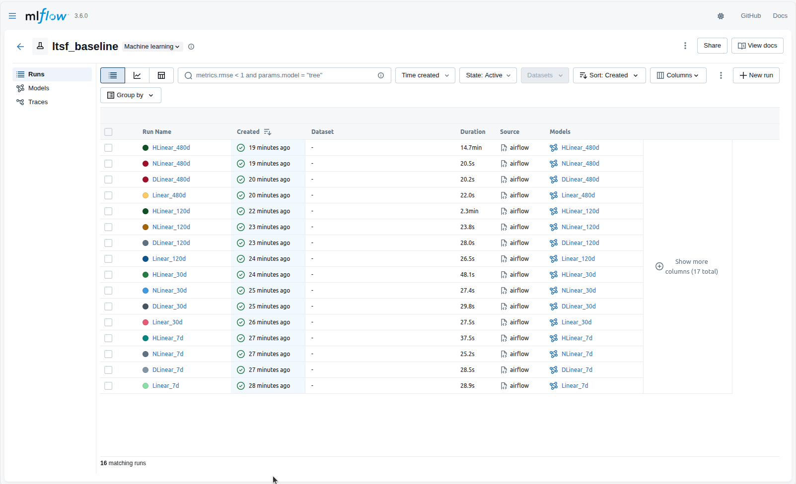
</div>

Chi tiết của một lượt chạy (Run Detail View) trên MLflow đóng vai trò như “hồ sơ kỹ thuật” đầy đủ nhất cho một lần huấn luyện mô hình. Tất cả thông tin quan trọng đều được ghi lại tự động từ Airflow, bao gồm siêu tham số, giá trị metric, log trong quá trình chạy, file cấu hình và môi trường thực thi. Nhờ đó, mỗi run có thể được tái lập đúng trạng thái ban đầu hoặc được dùng làm mốc đối chiếu để cải thiện mô hình ở các lần thử tiếp theo.  

<div align="center">
  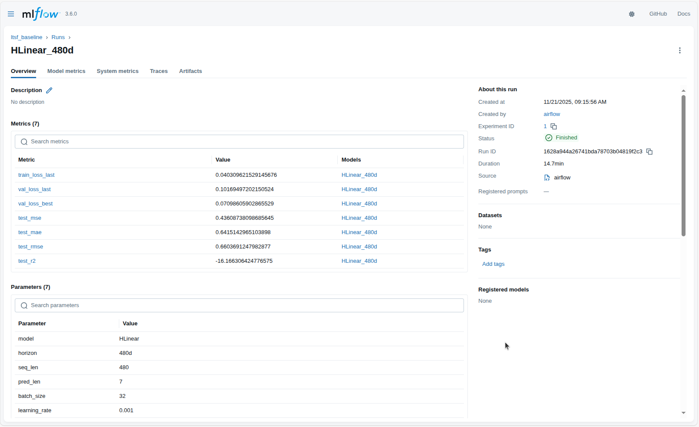
</div>

MLflow cũng lưu lại toàn bộ artifact sinh ra trong quá trình huấn luyện. Các artifact có thể bao gồm biểu đồ loss, hình minh họa dự báo, file cấu hình, checkpoint mô hình hoặc phiên bản model đã được đóng gói theo chuẩn MLflow. Việc tập trung toàn bộ artifact tại một nơi giúp việc kiểm tra lại pipeline, phân tích lỗi hoặc tái sử dụng mô hình trở nên dễ dàng hơn.  

<div align="center">
  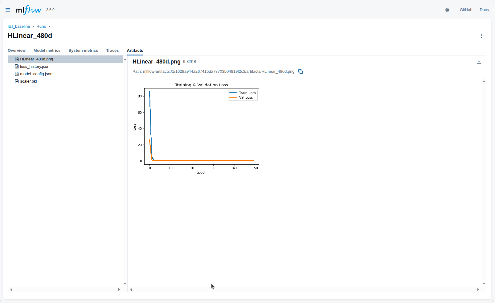
</div>

Khi số lượng thí nghiệm trở nên lớn hơn, MLflow cung cấp giao diện so sánh trực quan giữa các lần chạy. Việc đặt các run cạnh nhau giúp người dùng đánh giá xem cấu hình nào đem lại kết quả tốt nhất, mô hình nào hội tụ nhanh hơn hoặc metric nào thực sự phản ánh chất lượng dự báo. Hai hình dưới đây minh họa giao diện so sánh cơ bản và giao diện so sánh chi tiết của MLflow.  

<div style="display: flex; justify-content: center; align-items: flex-start;">
  
  
</div>

## 7. Kết quả thực nghiệm

<div style="display: flex; justify-content: center; align-items: flex-start; margin-bottom: 15px;">
  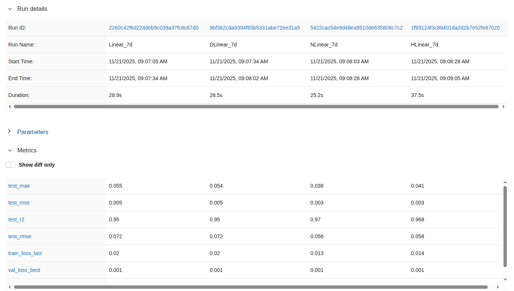
  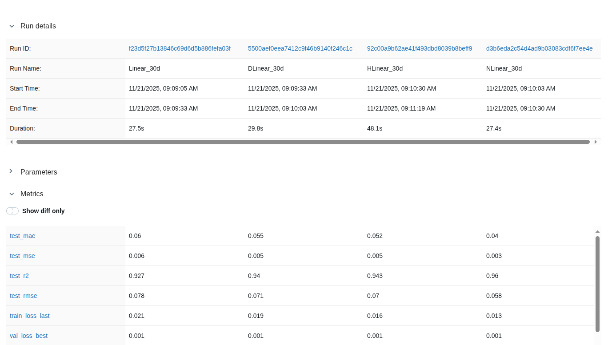
</div>

<div style="display: flex; justify-content: center; align-items: flex-start;">
  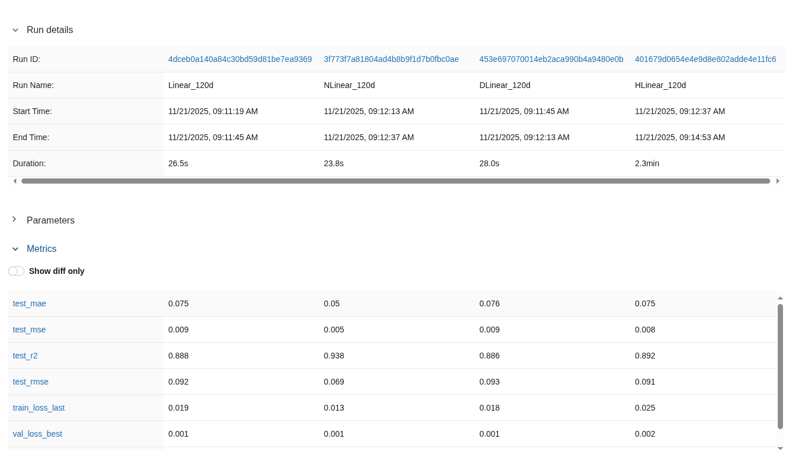
  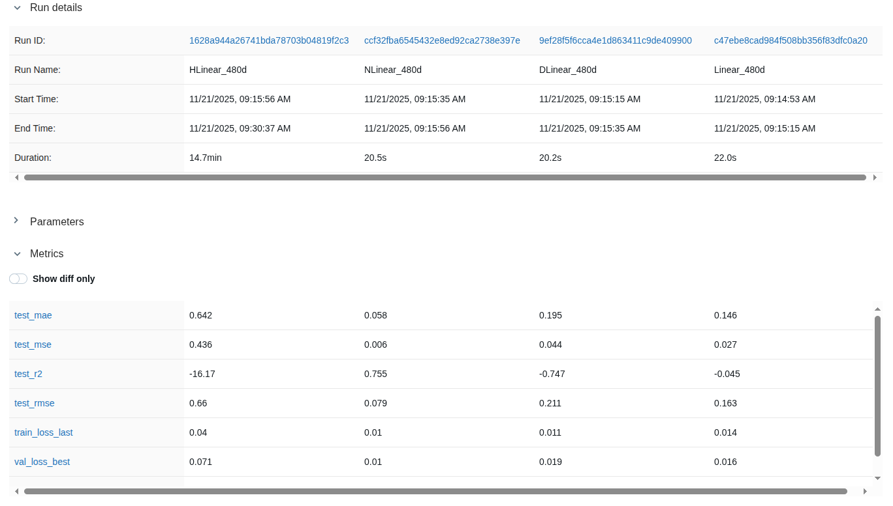
</div>

---

Dựa trên các hình ảnh so sánh kết quả các lượt chạy (Runs) từ **MLflow**, ta có thể đánh giá hiệu suất của bốn kiến trúc mô hình (**Linear, DLinear, NLinear, HLinear**) khi thay đổi **thời gian dự báo (Horizon)** từ 7 ngày đến 480 ngày.

Chúng ta sẽ tập trung vào chỉ số **test\_rmse** (Root Mean Squared Error) và **test\_mae** (Mean Absolute Error), với giá trị **càng thấp càng tốt**.

---

## Tóm Tắt Dữ Liệu Metrics Chính Xác trên tập Test (Chỉ số RMSE)

Bảng dưới đây tóm tắt chỉ số **test\_rmse** (giá trị chính xác) của bốn mô hình cho từng Horizon:

| Horizon | Linear | DLinear | **NLinear (Best)** | HLinear |
| :---: | :---: | :---: | :---: | :---: |
| **7d** | 0.072 | 0.072 | **0.056** | 0.058 |
| **30d** | 0.078 | 0.071 | **0.058** | 0.070 |
| **120d** | 0.092 | 0.093 | **0.069** | 0.091 |
| **480d** | 0.163 | 0.211 | **0.079** | **0.660** |

---

## Phân Tích Đánh Giá Hiệu Suất

### NLinear Là Mô Hình Chiến Thắng Nhất Quán

**Hiệu suất tổng thể:** Mô hình **NLinear** thể hiện hiệu suất vượt trội và ổn định nhất, đạt chỉ số **test\_rmse** thấp nhất trong *tất cả bốn Horizon* được thử nghiệm.

**Độ bền bỉ:** NLinear cho thấy khả năng **chịu đựng suy giảm hiệu suất** tốt nhất khi Horizon tăng lên, với sai số `test_rmse` chỉ tăng từ 0.056 (7d) lên **0.079** (480d).

### Sự Thất Bại của Mô Hình HLinear

**Horizon dài (480d):** Mô hình **HLinear\_480d** thất bại nghiêm trọng.

`test_rmse` tăng vọt lên **0.660** (cao gấp gần 8 lần NLinear).

Chỉ số **test\_r2** đạt giá trị âm rất lớn **-16.17**. Điều này khẳng định mô hình không thể sử dụng được cho dự báo dài hạn.

### Hiệu suất của Linear và DLinear

Hai mô hình này có hiệu suất tương đương nhau ở các Horizon ngắn, nhưng **luôn có sai số cao hơn NLinear**.

Đặc biệt ở **Horizon 480d**, cả Linear và DLinear đều có sai số tăng rất nhanh (`test_rmse` là 0.163 và 0.211), cho thấy tính không ổn định khi dự báo xa.

---

### Tóm Lại

Kết quả từ MLflow chứng minh rằng kiến trúc **NLinear** là lựa chọn **tối ưu nhất** cho dự án này, cung cấp **sai số thấp nhất** và thể hiện **độ bền bỉ** vượt trội khi đối mặt với nhu cầu **Dự báo chuỗi thời gian dài hạn (LTSF)**.


---

## 8. Bài Học Rút Ra từ Toàn Bộ Hệ Thống

Toàn bộ quá trình xây dựng pipeline, từ việc lựa chọn mô hình đến thiết lập hệ thống MLOps, đã mang lại nhiều bài học giá trị:

**Mô Hình Đơn Giản Chưa Bao Giờ Lỗi Thời**
Sự thành công của **NLinear** trong dự báo dài hạn (LTSF) chứng minh sức mạnh của những phương pháp *“giản dị nhưng thông minh”*.

Chính triết lý **tách rời các thành phần dữ liệu** đã tạo ra sự ổn định vượt trội trong môi trường tài chính nhiễu loạn.

**Tách Tín Hiệu (Signal) Khỏi Nhiễu (Noise) là Quan Trọng Hơn**
Kết quả thực nghiệm cho thấy hiệu quả tối ưu đến từ việc **phân rã dữ liệu đúng cách** (Decomposition), như cách DLinear hay NLinear đã làm, giúp mô hình tập trung vào xu hướng và loại bỏ nhiễu.

**MLOps Làm Nên Sự Khác Biệt**
Hệ thống **Airflow + MLflow** đã biến dự án từ một thử nghiệm thành một quy trình có thể tái lập. 

Cho phép thử nghiệm **nhiều siêu tham số (Horizon)** và **nhiều kiến trúc mô hình** một cách hiệu quả, nhanh chóng và có kiểm soát.

**Pipeline Tốt Giúp Mô Hình Phát Triển Bền Vững**
Một dự án bài bản bao gồm: **tổ chức mã nguồn**, **quản lý thí nghiệm**, và **tự động hóa workflow**. Airflow đảm bảo quy trình chạy đúng thứ tự, còn MLflow đảm bảo mọi kết quả đều được ghi lại.

---

## 9. Hướng Phát Triển và Mở Rộng

Hệ thống hiện tại hoàn toàn có thể được mở rộng để nâng cao hiệu suất và khả năng ứng dụng thực tế:

* **Dự báo Đa Biến (Multivariate Forecasting):** Mở rộng để dự báo nhiều cổ phiếu cùng lúc hoặc tích hợp thêm các yếu tố bên ngoài (ví dụ: chỉ số vĩ mô).
* **Tích hợp AutoML:** Sử dụng các công cụ như Optuna để tự động tìm kiếm bộ **hyperparameters** tối ưu.
* **Xây dựng REST API:** Đưa mô hình tốt nhất (NLinear) từ MLflow Model Registry ra môi trường thực tế thông qua một **REST API** để phục vụ dự báo **real-time**.
* **Bổ sung Kiểm soát Drift:** Thiết lập một DAG trong Airflow để định kỳ kiểm tra chất lượng mô hình (`Model Drift`) và cảnh báo khi hiệu suất giảm.

---

## 10. Kết Luận

Bài toán dự báo tài chính không chỉ là câu chuyện về mô hình phức tạp. Nó là câu chuyện về **kỹ thuật, tổ chức pipeline, quy trình ML hiện đại, và tư duy phân tích tín hiệu**.

Việc kết hợp các mô hình **LTSF-Linear** đã được chứng minh với một hệ thống **Airflow — MLflow** hoàn chỉnh đã mang lại hai kết luận cốt lõi:

1.  **Một pipeline tốt là nền tảng để mọi mô hình phát huy giá trị.**
2.  **Kiến trúc đơn giản như NLinear, khi được hỗ trợ bởi hệ thống MLOps vững chắc, có thể vượt trội so với các mô hình phức tạp trong bài toán LTSF.**

Từ mô hình cơ bản đến hệ thống hoàn chỉnh, đây là một hành trình thể hiện tinh thần kỹ thuật, tư duy rõ ràng và khả năng tổ chức bài toán theo chuẩn **MLOps thực chiến**.

# Tài liệu và nguôn tham khảo
* [Common Challenges in Time Series Financial Forecasting](https://www.phoenixstrategy.group/blog/common-challenges-in-time-series-financial-forecasting)
* [Time Series Forecasting AI: A Practical Guide](https://deepfa.ir/en/blog/time-series-forecasting-ai-practical-guide)
* [GitHub Repository: LTSF-Linear - Source Code của các mô hình cơ sở](https://github.com/cure-lab/LTSF-Linear)
* [Source Code: MLflow Integration và MLOps Setup (Project AIO)](https://github.com/ThuanNaN/aio2024-mlops/blob/main/Week-06-MLFlow)
* [Tài liệu AIO: Dự đoán chính xác cho dữ liệu time-series dùng NLinear và DLinear](https://www.facebook.com/share/p/1DNoHpRAZw/)